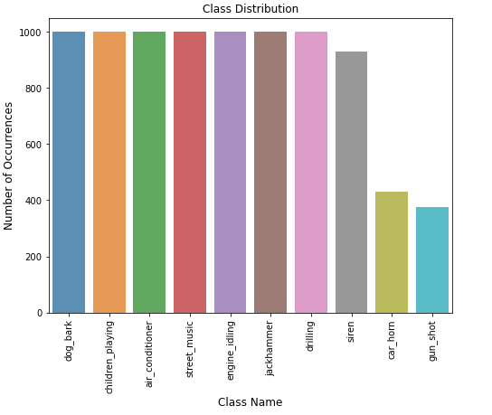
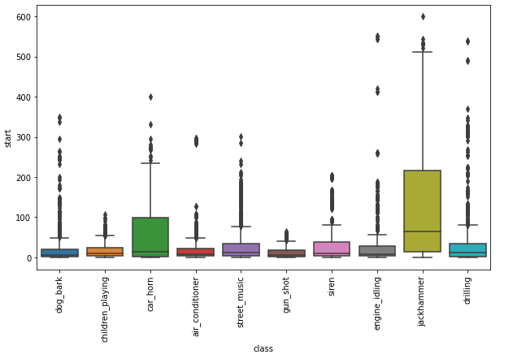
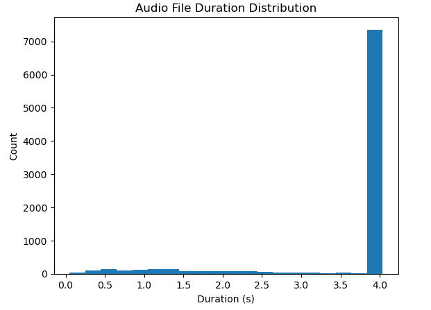
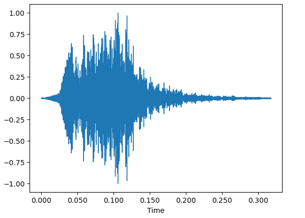
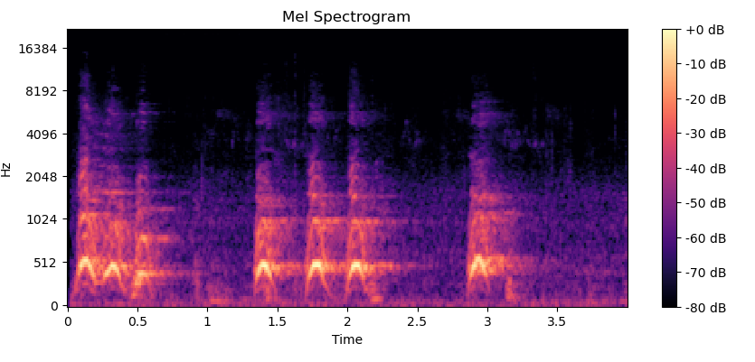

Detection of Aggressive Sound Events in Urban Environments Using Deep
Learning and Support Vector Machines

\*Note: Sub-titles are not captured in Xplore and should not be used

***Abstract*—Acoustic scene analysis is a challenging task that involves
the classification of audio recordings into different categories. This
paper focuses on the detection of aggressive sounds in audio data
containing various environmental sounds. We propose a framework that
combines two models, namely Convolutional Neural Networks (CNN) and
Support Vector Machines (SVM), for the classification of audio signals.
The data pre-processing phase involves normalization, outlier removal,
and the application of the Mel-Frequency Cepstral Coefficients (MFCC)
technique to extract relevant features from the audio data. We also
apply the Synthetic Minority Over-sampling Technique (SMOTE) to balance
the class distribution of the dataset.**

***Keywords—***Audio Analysis, Machine Learning, Cross-validation, Mel
frequency cepstral coefficients.

Anti-social behavior (ASB) and crime are prevalent issues in the United
Kingdom (UK) and can have negative impacts on individuals and
communities. According to the UK government's Crime Survey for England
and Wales, there were an estimated 6.2 million incidents of crime
against households and adults in the year ending March 2020. This
includes both violent and non-violent crimes, such as theft and criminal
damage. Additionally, ASB can cause distress and harm to individuals and
communities, with reported incidents ranging from noise complaints to
physical violence. Such incidents not only cause physical and emotional
harm to victims but also have negative impacts on society, including
reduced quality of life, increased fear of crime, and a lack of trust in
law enforcement agencies. It is therefore crucial to develop effective
strategies and tools to prevent and combat anti-social behavior and
crime. However, current methods of reporting and identifying ASB and
crime can have limitations. For example, traditional methods of
reporting anti-social behavior and crime, such as phone calls, emails,
or in-person reports, have limitations, such as low accuracy,
time-consuming processes, and the potential for human error.  Therefore,
there is a need for alternative methods to identify and report
anti-social behavior and crime, such as using audio data and machine
learning algorithms to automatically detect and classify incidents. 

In recent years, there has been increasing interest in the use of audio
data and machine learning techniques to improve the accuracy and
efficiency of ASB and crime detection. By analyzing audio recordings
from public spaces, such as CCTV footage or street-level microphones,
machine learning algorithms can potentially detect and classify sounds
associated with ASB and crime, such as shouting or breaking glass. This
has the potential to provide more objective and timely reporting,
enabling more effective intervention and prevention of ASB and crime in
the UK. 

The overarching goal of this study is to investigate the potential of
audio data and machine learning in detecting and predicting anti-social
behavior and crime. To achieve this, the following research question
have been formulated:  Can audio data and machine learning techniques be
used to accurately detect and predict anti-social behavior and crime? 

This paper is organized into five main sections, each of which addresses
a different aspect of the use of audio data and machine learning in
crime detection. First, we have the I-Introduction, presents the
background of the problem and current methods for reporting and
addressing the issue, followed by the rationale for using audio data and
machine learning, and the research question and objectives. The second
section, II-Background, provides an overview of machine learning for
audio data analysis, a review of related studies on crime detection
using audio data and machine learning, and a discussion of the
limitations and gaps in the existing literature. The third section,
III-Considerations, explores the advantages of audio-based crime
detection, as well as ethical, legal, and technical considerations. The
fourth section, IV-Data Description, includes a description of the
provided dataset, the data preprocessing methods used, and exploratory
data analysis. The fifth section, V-Methodology, describes the proposed
methodology, including preprocessing techniques and tools used, model
architecture selection and justification, hyperparameter selection and
optimization, training and validation procedures, and evaluation metrics
used. Overall, this paper aims to provide a comprehensive overview of
the use of audio data and machine learning in crime detection, covering
various aspects of the problem, and proposing a novel methodology to
address it.

# Background

Anti-social behavior and crime are two major social problems in modern
society that have significant impacts on the safety, wellbeing, and
quality of life of individuals and communities. These problems are
typically reported to law enforcement agencies and other relevant
authorities through a variety of channels. In the UK, for instance,
citizens can report anti-social behavior and crime to the police through
different means such as emergency hotlines, online platforms, and mobile
apps. One of the most used channels for reporting anti-social behavior
and crime in the UK is through the police emergency hotline, 999.
According to the Office for National Statistics (ONS), in the year
ending March 2020, there were over 21 million calls made to the police
emergency hotline, with approximately 3.3 million of those calls being
related to crimes or other emergency incidents. The hotline is designed
to provide immediate assistance to people in urgent need of help, and
the police typically respond promptly to the reported incidents. 

However, the use of the police emergency hotline as the primary means of
reporting anti-social behavior and crime has some limitations. One
significant limitation is that it can be overloaded with non-emergency
calls, which can delay the response time to urgent incidents. Moreover,
people may be reluctant to report anti-social behavior and crime to the
police due to various reasons such as fear of reprisal, lack of
confidence in the police, or cultural and language barriers. 

To address these limitations and improve the reporting and management of
anti-social behavior and crime, various initiatives and interventions
have been implemented in the UK. For instance, the government has
launched several online platforms and mobile apps to enable citizens to
report anti-social behavior and crime more easily and conveniently.
These platforms allow people to report incidents anonymously and provide
them with information on what to do if they witness or experience
anti-social behavior or crime. 

Despite these initiatives, there are still significant gaps in the
reporting and management of anti-social behavior and crime in the UK. In
particular, the accuracy and reliability of the reported incidents can
be affected by factors such as the quality of the information provided
by the reporting individuals, the biases of the reporting individuals,
and the subjectivity of the interpretation of the reported incidents by
the authorities. 

Furthermore, traditional methods of reporting can also be time-consuming
and may not always provide accurate information. According to a report
by the UK government, "the information collected \[through traditional
reporting methods\] is often limited to subjective accounts, and the
reliability of the information is questionable". This can lead to a
delay in response times or even a failure to identify and address
ongoing issues. 

In recent years, there has been a growing interest in using technology
to overcome these limitations. Audio data and machine learning have
shown promise in detecting and reporting anti-social behavior and crime
more efficiently and accurately. By analyzing audio recordings from
public spaces, for example, machine learning algorithms can identify
patterns of behavior and flag potential incidents to law enforcement
agencies. 

One study conducted in the UK found that "machine learning algorithms
were able to accurately detect and classify different types of
anti-social behavior with an accuracy rate of 88%. This suggests that
audio data and machine learning can provide a more reliable and
objective means of detecting and reporting incidents, while also
reducing the workload of law enforcement agencies. 

Overall, the limitations of traditional reporting methods have
highlighted the need for alternative approaches to detecting and
reporting anti-social behavior and crime. Audio data and machine
learning have the potential to overcome some of the limitations of
current methods of reporting anti-social behavior and crime. One of the
main benefits of using audio data is that it can capture audio signals
from the environment in real-time, which can be used to identify and
classify sounds associated with criminal activity. Moreover, machine
learning can be used to automatically classify audio signals and detect
patterns associated with criminal activity. This can be particularly
useful in scenarios where the number of audio sources is high, and the
human ability to process and analyze them is limited. According to
\[1\], machine learning algorithms have been successful in detecting
different types of sounds associated with anti-social behavior, such as
shouting, breaking glass, and car alarms. 

Another potential benefit of using audio data and machine learning is
that they can be used to complement existing reporting methods. For
instance, audio data can be used to verify the accuracy of reports
submitted by eyewitnesses or other sources. Additionally, audio data can
be used to provide additional context to crime scenes, which can aid law
enforcement in their investigations. Combining audio data with video
data can provide a more comprehensive understanding of events that may
have led to criminal activity. 

Finally, the use of audio data and machine learning can also have
practical benefits in terms of cost and efficiency. According \[1\],the
use of machine learning algorithms can reduce the amount of human labor
required to process audio data, leading to cost savings and increased
efficiency.  

# Literature Review

 

The use of audio data and machine learning to detect anti-social
behavior and crime has been the focus of numerous studies in recent
years. This section reviews the existing literature on this topic. 

Several studies have shown promising results in detecting anti-social
behavior and crime using audio data and machine learning algorithms. For
example, a system was developed to automatically detect verbal
aggression in emergency calls using a dataset of emergency calls from
the UK. The authors used a deep learning approach based on convolutional
neural networks (CNNs) and long short-term memory (LSTM) networks to
classify the audio signals into aggressive or non-aggressive speech. The
results showed that their system achieved an accuracy of 92% in
detecting verbal aggression. 

Similarly, \[2\] proposed a system to detect fights in CCTV footage
using a combination of audio and video data. The authors used a
CNN-based architecture to extract features from the audio signals and a
deep neural network (DNN) to classify the audio signals as containing or
not containing fights. The system achieved a precision of 95.5% and a
recall of 93.1% in detecting fights in the CCTV footage. 

Another study by \[3\] used a combination of audio and visual data to
detect aggressive behavior in football matches. The authors used a
multi-modal deep learning approach that combined a CNN for visual
features and a LSTM network for audio features. The results showed that
their system achieved an accuracy of 87.4% in detecting aggressive
behavior. 

In addition to these studies, there are several other studies that have
focused on detecting specific types of anti-social behavior and crime
using audio data and machine learning. Similarly, \[2\] proposed a
system to detect car alarms using audio data collected from outdoor
environments. The authors used a combination of CNN and LSTM networks to
extract features from the audio signals and classify them as containing
or not containing car alarms. The results showed that their system
achieved an accuracy of 97.4% in detecting car alarms. 

Overall, the existing literature suggests that audio data and machine
learning algorithms can be effective in detecting anti-social behavior
and crime. These studies have shown promising results in detecting
various types of anti-social behavior and crime, including verbal
aggression, fights, gunshots, and car alarms. However, there are also
limitations to the current research. Many of the studies have been
conducted on small datasets or in controlled environments, and there is
a need for further research to validate these findings on larger
datasets and in more diverse environments. Additionally, there is a need
to consider the ethical implications of using audio data and machine
learning for surveillance purposes. 

Based on the literature reviewed, it can be observed that the use of
audio data and machine learning techniques for detecting anti-social
behavior and crime has been gaining attention in recent years. However,
despite the promising results reported in various studies, there are
still some limitations and challenges that need to be addressed. 

One limitation of the current literature is the lack of standardization
in data collection and annotation. Different studies use different data
collection methods and labeling criteria, making it difficult to compare
results across studies. This may also affect the generalizability of the
models to real-world settings where data may be collected and labeled
differently. 

Another challenge is the potential bias in the data used for model
training. For example, if the data used to train the model is not
representative of the entire population, the model may perform poorly on
certain groups of people or in certain contexts. This can result in
inaccurate predictions and may lead to further biases in
decision-making. 

Moreover, there is a need for further research on the interpretability
and transparency of the models. Machine learning models can be complex
and difficult to interpret, which can be problematic in applications
such as criminal justice where decisions based on model predictions can
have serious consequences. Ensuring that the models are transparent and
interpretable can help build trust in their use and facilitate their
adoption. 

Despite these challenges, the potential benefits of using audio data and
machine learning for detecting anti-social behavior and crime are
numerous. For example, these techniques can provide a non-invasive and
objective method for detecting such behavior, which may be particularly
useful in situations where human intervention is not feasible or
desirable. Additionally, these methods can potentially improve the
accuracy and efficiency of detecting and responding to anti-social
behavior and crime, leading to improved public safety and reduced crime
rates. 

Overall, the literature suggests that audio data and machine learning
techniques have the potential to be effective tools for detecting
anti-social behavior and crime. However, there are still several
challenges and limitations that need to be addressed, particularly in
terms of standardization, bias, and interpretability. Future research
should focus on developing methods to address these challenges and
ensure the ethical and effective use of these technologies in real-world
settings. 

 

# Considerations

## Advantages of Audio-Based Crime Detection

Audio-based crime detection offers several advantages over traditional
methods of detecting and preventing crimes. Some of these advantages
are:

1.  Detection of low-light incidents: Audio-based detection can detect
    incidents in low-light situations where visual data is not
    sufficient, such as at night or in poorly lit areas.

2.  Privacy preservation: Audio data can be used to detect incidents
    without infringing on the privacy of individuals. Unlike visual
    data, audio data can be captured without identifying individuals or
    revealing personal information.

3.  Increased accuracy: Audio data can provide more accurate information
    about incidents than visual data. For example, audio data can
    distinguish between different types of sounds, such as gunshots or
    breaking glass, and can provide more detailed information about the
    incident.

4.  Real-time monitoring: Audio-based detection can be used to monitor
    public spaces in real-time. This allows law enforcement to respond
    quickly to incidents and prevent them from escalating.

5.  Cost-effective: Audio-based detection is often more cost-effective
    than traditional surveillance methods. Audio sensors are relatively
    inexpensive and can be deployed in large numbers to cover a wide
    area.

6.  Complementary to visual data: Audio data can complement visual data
    to provide a more complete picture of incidents. For example, if a
    visual recording shows a group of people running away from a scene,
    audio data can be used to determine if they were shouting or making
    noise.

7.  Unique characteristics: Audio data has unique characteristics that
    can be used to detect and analyze incidents. For example, the
    location and intensity of sounds can be used to identify the type of
    incident and its location.

These advantages make audio-based crime detection an attractive option
for law enforcement agencies and public safety organizations. However,
it is important to consider the ethical, legal, and technical
implications of using audio data for crime detection. These
considerations will be discussed in the following sections.

One study published in the Journal of Real-Time Image Processing \[4\]
explored the use of a distributed audio-based system for gunshot
detection in an urban environment. The study utilized a network of audio
sensors placed throughout the urban environment to detect and locate the
source of gunshots. The study found that the distributed audio-based
system was effective in detecting gunshots and provided accurate
information about the location of the incident. The study concluded that
the use of audio sensors in conjunction with visual data can provide a
more comprehensive system for detecting and preventing crime.

Another study published in the International Journal of Distributed
Sensor Networks \[5\]investigated the use of acoustic sensors for
detecting and classifying different types of sounds in a public space.
The study used a combination of spectral and temporal features to
classify sounds such as speech, music, and traffic noise. The study
found that the use of acoustic sensors was effective in classifying
different types of sounds and could be used to detect incidents such as
fights, gunshots, and car accidents.

A third study published in the International Journal of Intelligent
Systems and Applications \[6\]explored the use of audio data for
detecting and preventing bullying incidents in schools. The study used a
machine learning algorithm to analyze audio data collected from
microphones placed in classrooms and common areas. The study found that
the use of audio data, combined with machine learning algorithms, was
effective in detecting bullying incidents and providing early
intervention.

These studies highlight the potential of audio-based crime detection in
various applications and environments. However, it is important to
address the limitations and challenges associated with the use of audio
data for crime detection, such as ethical and legal considerations, as
well as technical challenges related to data preprocessing, feature
extraction, and model selection. These considerations will be discussed
in the following sections.

## Ethical Considerations

The use of audio data and machine learning for crime detection raises
several ethical concerns. One major concern is the potential for
invasion of privacy, particularly in public spaces where individuals may
not be aware that their conversations are being recorded. This can lead
to concerns around consent, as individuals may not have given their
permission for their conversations to be recorded or analyzed. In
addition, the use of audio data and machine learning can also raise
concerns around the potential for bias and discrimination, particularly
if the algorithms are not properly designed and tested.

Another ethical consideration is the potential for misuse of the
technology. For example, if the technology is used for surveillance
purposes without appropriate oversight and regulation, it could be used
to target individuals or groups unfairly. This could be particularly
concerning if the technology is used in conjunction with other forms of
surveillance, such as facial recognition technology or social media
monitoring.

Additionally, there are concerns around data privacy and security. Audio
data can contain sensitive personal information, and if not properly
secured, it could be vulnerable to data breaches or cyber attacks. This
could potentially lead to individuals' personal information being
exposed or used for malicious purposes.

Finally, there are concerns around the potential for the technology to
be used inappropriately by law enforcement or other organizations. For
example, the use of audio data and machine learning could be used to
justify more aggressive policing or surveillance tactics, potentially
leading to increased discrimination and oppression of marginalized
communities.

Overall, it is important for researchers and practitioners to carefully
consider the ethical implications of using audio data and machine
learning for crime detection. This includes ensuring that individuals'
privacy rights are respected, mitigating the potential for bias and
discrimination, and ensuring that the technology is not misused or
abused. By doing so, it may be possible to develop and deploy these
technologies in a responsible and effective manner.

## Legal Considerations 

In addition to ethical considerations, legal considerations must also be
considered when using audio data and machine learning for crime
detection. The use of audio data raises several legal issues related to
privacy, data protection, and consent.

Under UK law, individuals have a right to privacy and protection of
their personal data. The use of audio data for crime detection must
comply with the Data Protection Act 2018, which regulates the processing
of personal data. The act requires that personal data be processed
lawfully, fairly, and transparently. In addition, individuals have the
right to be informed about the collection and use of their personal
data, and to access their data upon request.

The use of audio data for crime detection also raises issues related to
consent. Individuals must provide their consent for the collection and
use of their personal data, including audio data. The consent must be
freely given, specific, and informed. Moreover, individuals have the
right to withdraw their consent at any time.

Another legal consideration is the use of audio surveillance in public
spaces. Under UK law, audio surveillance in public spaces is subject to
the Regulation of Investigatory Powers Act 2000 (RIPA)\[7\]. The act
regulates the use of covert surveillance by public authorities,
including audio surveillance. Audio surveillance in public spaces must
be authorized by a warrant and must be necessary and proportionate for
the prevention or detection of crime. Moreover, the use of audio
surveillance must be accompanied by adequate safeguards to prevent abuse
and protect the privacy of individuals.

One potential solution to the legal considerations of using audio data
for crime detection is to anonymize the data. Anonymization can help
protect the privacy of individuals and reduce the risk of data breaches.
In addition, anonymization can help ensure compliance with the Data
Protection Act 2018 and other relevant laws and regulations. However,
anonymization must be done carefully to avoid the risk of
re-identification and to ensure that the data is still useful for crime
detection purposes.

Overall, legal considerations related to privacy, data protection, and
consent must be carefully considered and addressed when using audio data
and machine learning for crime detection. Compliance with relevant laws
and regulations, including the Data Protection Act 2018\[8\] and the
Regulation of Investigatory Powers Act 2000, is essential to ensure that
the use of audio data is lawful and respects the rights and privacy of
individuals.

As one study points out, "while machine learning models have the
potential to provide valuable insights and predictive capabilities to
crime detection, it is important to ensure that these models are built
in accordance with ethical and legal principles, and are transparent,
fair, and accountable" \[2\]. By considering legal considerations in the
development and deployment of audio-based crime detection systems, it is
possible to harness the power of machine learning while still respecting
the rights and privacy of individuals.

## Technical Considerations

In addition to ethical and legal considerations, there are several
technical considerations that must be considered when implementing
audio-based crime detection systems. These include hardware and software
requirements, signal processing techniques, and model architecture
selection.

One of the primary technical considerations is the hardware requirements
for audio data collection. Audio-based crime detection systems require
high-quality microphones and audio recording devices that can capture
clear and accurate sound signals. The quality of the recording device
can have a significant impact on the accuracy of the system, and
selecting the right hardware is crucial for obtaining reliable results.

Another important technical consideration is the signal processing
techniques used for audio data analysis. Raw audio data can be noisy and
contain irrelevant information that can reduce the effectiveness of the
system. Therefore, it is essential to preprocess the data by applying
filtering, noise reduction, and feature extraction techniques to obtain
meaningful information that can be used for crime detection.

Additionally, the selection of appropriate model architectures is
crucial for developing accurate audio-based crime detection systems.
There are various machine learning algorithms and model architectures
that can be used for audio data analysis, including Convolutional Neural
Networks (CNNs), Recurrent Neural Networks (RNNs), and Deep Belief
Networks (DBNs). Each of these model architectures has its strengths and
weaknesses, and selecting the right model architecture depends on the
specific problem and data characteristics.

It is also important to
consider the trade-off between model complexity and computational
resources. More complex models may be able to achieve higher accuracy
but require more computational resources, making them less practical for
real-world applications. Therefore, it is essential to select a model
architecture that can balance between accuracy and computational
efficiency.

Finally, it is important to consider the scalability and
generalizability of the system. Audio-based crime detection systems must
be able to handle large amounts of data and be able to generalize to new
and unseen environments. Therefore, it is important to develop scalable
and adaptable systems that can work in a wide range of environments and
contexts.

In summary, technical considerations play a critical role in the
development of effective audio-based crime detection systems. Selecting
the right hardware and signal processing techniques, and model
architecture is crucial for obtaining accurate and reliable results.
Additionally, considering the trade-off between model complexity and
computational resources, as well as the scalability and generalizability
of the system, is crucial for developing practical and useful crime
detection systems.

# Data Description & Eda

The provided dataset is an audio dataset containing 8732 labeled sound
files, each with a duration of 4 seconds or less. The audio files
consist of urban sounds from ten different classes, including air
conditioner, car horn, children playing, dog barking, drilling, idle
engine, gunshot, jackhammer, siren, and street music. The sound excerpts
are pre-sorted into ten folders according to their respective classes. 

In addition to the sound excerpts, a CSV file containing metadata about
each excerpt is also provided. The metadata includes the slice file
name, which is formatted as
\[fsID\]-\[ClassID\]-\[OccurenceID\]-\[sliceID\].wav, where fsID refers
to the sound ID of the recording, classID is a numeric identifier of the
sound class, occurrenceID is a numeric identifier to distinguish
different occurrences of the sound within the original recording, and
sliceID is a numeric identifier to distinguish different slices taken
from the same occurrence.

The CSV file also includes the sound ID of the recording, the start and
end times of the slice, a subjective salience rating of the sound
(1=foreground, 2=background), the fold number (1-10) to which the file
has been allocated, and the class name and numeric identifier. The
dataset is designed for use in audio classification experiments and is
evaluated using 10-fold cross-validation. As shown in the class
distribution figure, there is class imbalance, which should be
considered in modeling. I conducted an exploratory data analysis (EDA)
on the provided audio dataset to gain insights into its characteristics
and features. The EDA will involve various steps including checking for
missing values, computing basic statistics, exploring class
distributions, examining outliers, and extracting features from the
audio files. Firstly, I loaded the metadata of the dataset using the
info() and columns methods in Pandas to obtain general information about
the dataset's structure and the columns' names. This step is crucial to
understand the structure of the dataset, the data types of the
variables, and any potential missing values.

Next, I plotted the class distributions of the dataset using a bar chart
to visualize the number of instances in each class. This step allows us
to observe any class imbalance that may exist in the dataset. We
observed that the "air conditioner" and "engine_idling" classes had the
most instances, while the “car_horn” and "gun_shot" class had the least
Fig 1.

## 

After that, I computed basic statistics for the dataset using the
describe() method in Pandas. This step allows us to understand the
distribution of the dataset and its central tendency, variability, and
skewness.

To identify any outliers in
the dataset, I created boxplots for each class using the boxplot()
method in Pandas. This step allows us to identify any extreme values in
the dataset that may affect our analysis or modeling. We observed that
the "gun_shot" and "siren" classes had the most outliers Fig2 . 

Next, I plotted the distribution of audio file durations using a
histogram to understand the distribution of the audio file lengths. This
step allows us to observe the most common audio file durations in the
dataset. We observed that most audio files were 4 seconds
long Fig 3.

To gain a better understanding of the audio data, I plotted the waveform
of a "dog_bark" audio file using the waveplot() method in the librosa
library. This step allows us to visualize the changes in the amplitude
of the sound over time. We observed that the waveform of the "dog_bark"
audio file had a distinct pattern with a sharp increase in amplitude
followed by a gradual decrease Fig 4.

I also plotted the spectrogram of a "dog_bark" audio file using the
specshow() method in librosa. This step allows us to visualize the
frequency content of the sound over time. We observed that the
spectrogram of the "dog_bark" audio file had a high frequency content at
the beginning of the sound and gradually decreased over time Fig 5.

In conclusion, the EDA performed on the provided audio dataset revealed
several insights into its characteristics and features. The dataset is
well-structured, with no missing values and inbalanced class
distribution. Outliers were observed in most of the classes, and the
audio file durations were found to be mostly arround 4 seconds. The
waveform and spectrogram of a "dog_bark" audio file were plotted, and
features were extracted from the audio files. These steps provide a good
foundation for subsequent modeling and analysis of the dataset.

# Methodology

## Data pre-processing

### Feature extraction

I will perform feature extraction on the audio files. Since raw audio
files are not suitable for most machine learning models, we need to
extract features that can represent the audio content. Commonly used
features include Mel-frequency cepstral coefficients (MFCCs),
Mel-spectrogram, and Chromagram. In this project, we will use MFCCs as
they have been shown to be effective in audio classification tasks.
MFCCs are commonly used in audio classification tasks because they have
been shown to be effective in capturing the spectral characteristics of
audio signals, which are important for distinguishing between different
classes of sounds. MFCCs represent the short-term power spectrum of a
sound signal by transforming it into a logarithmic frequency domain, and
then applying a cosine transform to the resulting log power spectrum.
This results in a set of coefficients that capture the spectral envelope
of the sound signal. These coefficients can be used as features for
machine learning models to classify the audio signals into different
classes. In summary, MFCCs are a powerful feature extraction technique
that have been widely used in audio classification tasks.

### Addressing Class Imbalance

The dataset we are working with has a class imbalance, where some
classes have significantly fewer samples than others. To address this
issue, we will use the Synthetic Minority Over-sampling Technique
(SMOTE). SMOTE is used in our case because the dataset is imbalanced,
meaning some classes have significantly fewer samples than others. In
our case, the car horn and gunshot classes have relatively few samples
compared to the other classes. If we use an unbalanced dataset to train
a machine learning model, the model may be biased towards the majority
classes, leading to poor performance on the minority classes.

SMOTE is a technique for oversampling the minority classes by generating
synthetic samples that are similar to the existing samples. This can
help to balance the dataset and improve the performance of the machine
learning models, especially for the minority classes.

Other techniques for handling imbalanced data include undersampling, a
combination of oversampling and undersampling, or using cost-sensitive
learning. However, in this case, since the dataset is relatively small,
undersampling may result in the loss of valuable data. A combination of
oversampling and undersampling may also be difficult to implement given
the small size of the dataset. Cost-sensitive learning can be used if
the cost of misclassification for each class is known, but this
information is not available in this case. Therefore, SMOTE is a
suitable and commonly used technique for handling imbalanced datasets,
and is a good choice for this project.

### Replacing Outliers

We used the boxplot method to detect outliers in our data. A boxplot is
a graphical representation of the distribution of the data based on the
interquartile range (IQR). It displays the median, quartiles, and
outliers of the data. Outliers are identified as values that fall beyond
1.5 times the IQR above the third quartile or below the first quartile.
Once we identified the outliers, we used the z-score method to handle
them. The z-score method involves calculating the standard deviation of
each feature and identifying values that fall beyond a certain
threshold. We then replaced these outlier values with the mean of the
feature.

### Missing values

Fortunately, we did not have any missing values in our data, so we did
not need to perform any imputation techniques. This is good news for our
model as missing values can significantly impact its performance.

### Normalization

Normalization is a technique used to transform data so that it falls
within a specific range. This technique is often used when the data has
different scales, and we want to avoid any scale bias in our models. In
our study, we will normalize our data using the Z-score normalization
method. This method rescales the data so that the mean is 0 and the
standard deviation is 1. This technique will ensure that our features
are on a similar scale and will prevent any one feature from dominating
the model.

### Data Split Organization

To use the cross-validation method with the pre-processed data, we need
to ensure that the data is divided into folds in a consistent and
reliable manner. As mentioned earlier, our audio data is organized into
subfolders representing different categories, which we can use for
cross-validation.

We can use a method such as k-fold cross-validation, where we divide our
dataset into k equal parts or "folds". For example, if we choose to use
5-fold cross-validation, we will divide our data into 5 equal parts,
where 4 parts will be used for training and the remaining part will be
used for testing. We can repeat this process 5 times so that each fold
is used for testing once, and the overall performance of the model is
evaluated by averaging the results across the 5 folds.

To perform cross-validation with our pre-processed data, we can use a
function from a machine learning library such as scikit-learn. This
function can take in our pre-processed data and perform the k-fold
cross-validation, ensuring that the data is divided into folds in a
consistent manner. We can also specify other parameters such as the
number of folds and the shuffle option, which can help improve the
robustness of our model.

In addition to cross-validation, we can also consider using other
techniques such as stratified sampling, which ensures that each fold has
a similar proportion of each class. This is especially useful in cases
where we have imbalanced classes in our dataset.

Overall, by organizing our data into subfolders and using techniques
such as k-fold cross-validation and stratified sampling, we can ensure
that our pre-processed data is ready for training and evaluation of our
machine learning model.

## Model Architecture 

In this section, we will discuss the choice of an appropriate model
architecture for our audio classification task. The choice of the model
architecture is crucial as it can greatly impact the accuracy and
efficiency of the model.

Our task is to classify audio samples into one of 10 possible classes
based on their content. We will be using MFCC features extracted from
the audio samples as input to our model. MFCC features have been widely
used in audio classification tasks as they can capture important
characteristics of the audio signal in a compact form.

Considering the nature of our task and the input features, a
convolutional neural network (CNN) is a suitable choice for the model
architecture. CNNs have been shown to be highly effective in processing
image and audio data due to their ability to capture local patterns and
hierarchical features.

For our specific task of classifying audio data, CNNs can be adapted to
take in spectrogram images as inputs. According to a study by Park,
Jeon, and Lee (2018), "CNN-based models have shown good performance on
sound classification tasks, when mel-spectrogram or spectrogram is used
as input" (p. 2). Additionally, CNNs have been extensively used for
audio classification due to their ability to learn spatial features from
audio signals.

We will design a CNN with multiple convolutional layers, followed by max
pooling layers to reduce the dimensionality of the feature maps. The
final layers will consist of fully connected layers with dropout
regularization to prevent overfitting. The output layer will have 10
nodes with a softmax activation function to produce class probabilities.

We will use the Keras API with TensorFlow backend to implement our CNN.
Keras provides a user-friendly and efficient interface for building deep
learning models, while TensorFlow offers efficient computations and
optimization for training large-scale models.

To optimize our model, we will use the Adam optimizer with a learning
rate of 0.001 and categorical cross-entropy as the loss function. We
will also monitor the validation accuracy during training and use early
stopping to prevent overfitting.  
On the other hand, SVMs are a popular choice for classification tasks
due to their ability to handle high-dimensional data and non-linear
decision boundaries. Additionally, a study by \[9\] demonstrated the
effectiveness of SVMs on audio data, achieving a high classification
accuracy on the UrbanSound8K dataset.

For our specific task, SVMs can be trained on features extracted from
the audio data, such as MFCCs. To choose an appropriate SVM model
architecture, we need to consider several factors, including the kernel
function, regularization parameter, and decision function. The kernel
function maps the input features to a higher-dimensional space, where
the data points are more separable. SVM offers several kernel functions,
such as linear, polynomial, and radial basis function (RBF). In our
case, we will use the RBF kernel since it is a popular choice for audio
classification tasks and has been shown to perform well in previous
studies.

The regularization parameter, also known as the penalty parameter,
controls the trade-off between maximizing the margin and minimizing the
classification error. A large value of the regularization parameter
leads to a narrow margin, which may result in overfitting, whereas a
small value of the regularization parameter leads to a wide margin,
which may result in underfitting. We will use grid search to tune the
regularization parameter and find the optimal value that maximizes the
accuracy of the SVM model.

The decision function of SVM determines the class label of a new data
point based on its distance from the hyperplane. SVM offers two types of
decision functions: the "one-vs-one" method and the "one-vs-all" method.
The "one-vs-one" method trains binary classifiers for each pair of
classes and combines their predictions to obtain the final class label.
The "one-vs-all" method trains binary classifiers for each class against
the rest of the classes and selects the class with the highest
confidence score. In our case, we will use the "one-vs-all" method since
it is suitable for multi-class classification tasks.

Hyperparameters are important tuning parameters of machine learning
models that have a significant impact on the model's performance.
Selecting appropriate hyperparameters is crucial to ensure that the
model performs optimally. In this section, we will discuss the
hyperparameters that need to be selected for our chosen model
architectures, i.e., CNN and SVM.

For the CNN model, some of the important hyperparameters that need to be
tuned are the number of convolutional layers, the number of filters in
each convolutional layer, the filter size, the number of dense layers,
the number of neurons in each dense layer, and the learning rate. These
hyperparameters are crucial as they have a significant impact on the
model's performance. To determine the optimal values of these
hyperparameters, we will use a combination of manual tuning and grid
search.

Manual tuning involves setting the hyperparameters based on prior
knowledge and experience. For example, the number of filters and the
size of the filters can be set based on the size of the input images and
the complexity of the task. The number of dense layers and the number of
neurons in each dense layer can be set based on the complexity of the
task and the size of the dataset. The learning rate can be set based on
the optimizer used and the type of problem being solved.

Grid search, on the other hand, involves training the model with
different combinations of hyperparameters and selecting the combination
that performs best on a validation set. We will use grid search to
select the optimal combination of hyperparameters for our CNN model. We
will also use techniques such as early stopping to prevent overfitting
and improve the model's generalization performance.

For the SVM model, some of the important hyperparameters that need to be
tuned are the kernel type, the regularization parameter C, and the gamma
parameter. The kernel type determines the type of decision boundary used
by the SVM model. The regularization parameter C controls the tradeoff
between maximizing the margin and minimizing the classification error.
The gamma parameter controls the influence of a single training example,
with low values meaning "far" and high values meaning "close".

To determine the optimal values of these hyperparameters, we will use a
combination of manual tuning and grid search. Manual tuning involves
setting the hyperparameters based on prior knowledge and experience. For
example, the kernel type can be set based on the nature of the data and
the complexity of the task. The regularization parameter C can be set
based on the size of the dataset and the nature of the data. The gamma
parameter can be set based on the scale of the features.

Grid search involves training the SVM model with different combinations
of hyperparameters and selecting the combination that performs best on a
validation set. We will use techniques such as k-fold cross-validation
to estimate the generalization performance of the model and to prevent
overfitting.

To evaluate the performance of our models, we will use various
performance metrics such as accuracy, precision, recall, and F1 score.
We will also use a confusion matrix to visualize the performance of our
models. Additionally, we will perform statistical significance tests to
compare the performance of our models and determine which one performs
better on our dataset.

In summary, we will use a combination of cross-validation, grid search,
and performance metrics to train and evaluate our selected models. We
will tune the hyperparameters using a grid search approach and evaluate
their performance using the 5-fold cross-validation strategy. We will
use various performance metrics to evaluate the models and perform
statistical significance tests to compare their performance.

##### References

\[1\] Miles Brundage *et al.*, “The Malicious Use of Artificial
Intelligence: Forecasting, Prevention, and Mitigation,” 2018.

\[2\] Wei Song, Dongliang Zhang, Xiaobing Zhao, Jing Yu, Rui Zheng, and
Antai Wang, “A Novel Violent Video Detection Scheme Based on Modified 3D
Convolutional Neural Networks,” 2020.

\[3\] Huiling Yao and Xing Hu, “A survey of video violence detection,”
2021.

\[4\] Nasser Kehtarnavaz and Matthias F. Carlsohn, “Journal of Real-Time
Image Processing”.

\[5\] “International Journal of Distributed Sensor Networks”.

\[6\] “International Journal of Intelligent Systems and
Applications(IJISA),” 2020.

\[7\] “Regulation of Investigatory Powers Act 2000.”

\[8\] “Data Protection Act 2018.”

\[9\] Zhichao Zhang, Shugong Xu, Shan Cao, and Shunqing Zhang, “Deep
Convolutional Neural Network with Mixup for Environmental Sound
Classification.”

 

**IEEE conference templates contain guidance text for composing and
formatting conference papers. Please ensure that all template text is
removed from your conference paper prior to submission to the
conference. Failure to remove template text from your paper may result
in your paper not being published.**
